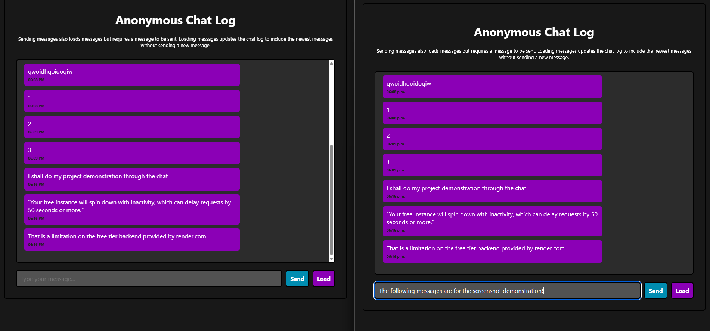
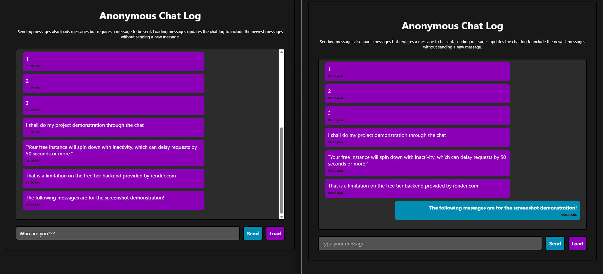
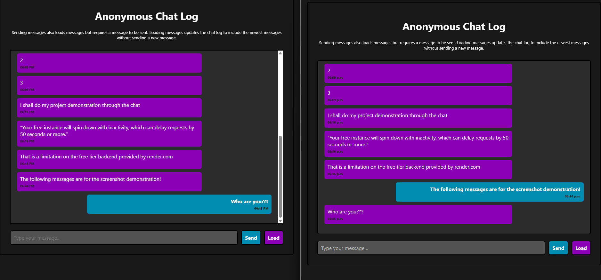

# Anonymous Message Board
A website that lets you message with everyone else on the website anonymously. 
**Link:** https://student7898.github.io/anonymous-message-board/

### Main Features
 - Sending messages anonymously
 - Access to everyone on the website
 - Easy configurability to allow for more messages of larger length
 - Messages persist after leaving the website (up to a maximum of 50, which can be changed)

### Purpose
 - Great for practicing how to connect a backend and frontend

### Dependencies
 - Python 3.13.1
    - Flask
    - flask-cors

### Testing
**Note**
Each separate part of the project, like frontend and backend, is separated into different branches. 

**Frontend:** 
1. Download a copy of the files and run index.html locally on your machine.

**Backend:** 
1. Run the command `pip install -r requirements.txt` in the terminal assuming you have python installed (Python 3.13.1)
2. Run the app.py file by using the command `python app.py` in the terminal
3. Replace API_URL to "http://localhost:5000/api/messages" in script.js

# References

### API
 - https://developer.mozilla.org/en-US/docs/Web/API/Window/crypto
 - https://developer.mozilla.org/en-US/docs/Web/API/Document/createElement
 - https://developer.mozilla.org/en-US/docs/Web/API/Window/fetch

### JavaScript
 - https://developer.mozilla.org/en-US/docs/Web/JavaScript/Reference/Global_Objects/Date
 - https://developer.mozilla.org/en-US/docs/Web/API/Element/scrollTop

### CSS
 - https://developer.mozilla.org/en-US/docs/Web/CSS/transition
 - https://developer.mozilla.org/en-US/docs/Web/CSS/overflow-y
 - https://developer.mozilla.org/en-US/docs/Web/CSS/flex-grow

### Python Flask
 - https://flask.palletsprojects.com/en/stable/
 - https://www.youtube.com/watch?v=VRoXgHyJGx8
 - https://www.youtube.com/watch?v=944LoZ7OIMk

### Python
 - https://docs.python.org/3/library/datetime.html
